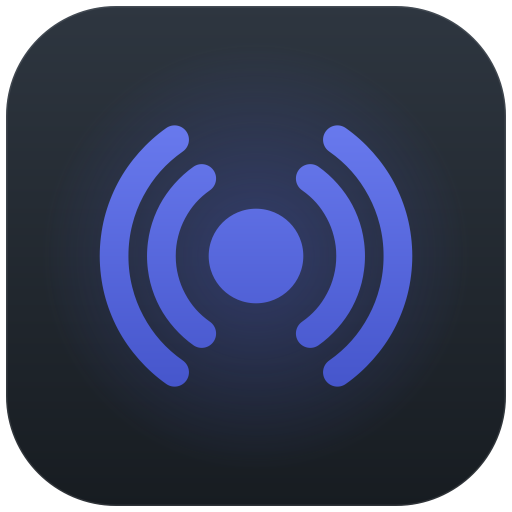
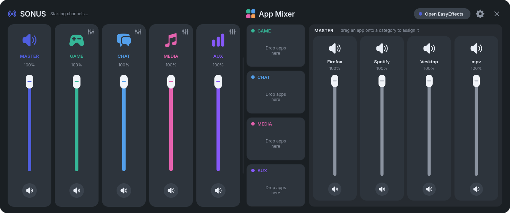
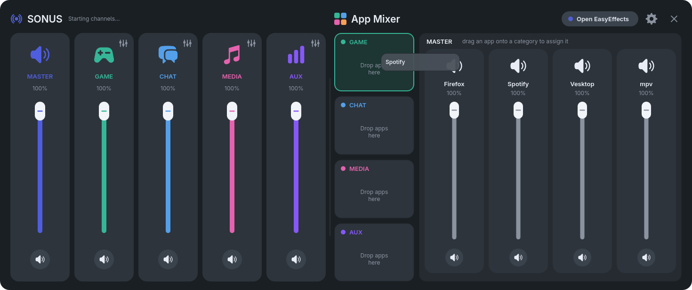
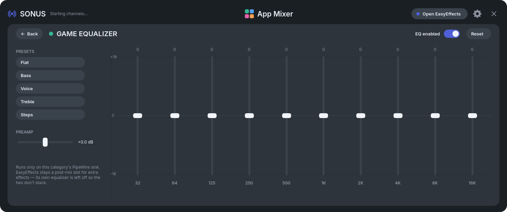

<div align="center">



# Sonus

**Sonar-style volume mixer for PipeWire.** Master / Game / Chat / Media / Aux channels, drag-and-drop app routing, and a 10-band equalizer per category — one hotkey away.

[](#)
[](#)
[](#)
[](LICENSE)



*Linux counterpart to [SteelSeries Sonar](https://steelseries.com/gg/sonar) — sibling of [SonarDeck](https://github.com/T3lluz/SonarDeck).*

</div>

## ⚡ Install

```bash
curl -fsSL https://gitlab.com/T3lluz/Sonus/-/raw/main/install.sh | bash
```

One line installs the dependencies, creates the Game / Chat / Media / Aux sinks, tames EasyEffects (no second EQ, no stream stealing), and starts the panel. Re-run it to **update**, append `-s -- uninstall` to **remove**. From a checkout: `./install.sh`.

- App lives in `~/.local/share/sonusdeck`, launchers `sonusdeck` / `sonusdeck-toggle` in `~/.local/bin`
- First launch registers **Ctrl+Alt+V**, a desktop entry, and start-on-login (toggle in Settings) — Sonus starts hidden and waits for the hotkey
- Different key? Rebind *Sonus Toggle* in your desktop's shortcut settings
- Settings, routes, and EQ curves persist in `~/.config/sonusdeck/settings.json`

## 🎚️ Mixer

**Ctrl+Alt+V** shows or hides the panel.

| Where | What |
| --- | --- |
| Left faders | Master + category volumes (Game / Chat / Media / Aux) |
| MASTER container | Every app playing sound, each with its own fader |
| Drag an app onto a bin | Assign it to that category — drag its chip back to MASTER to unassign |
| Click an app's header | Same assignment, as a menu |
| Sliders icon on a category | Open that category's equalizer |
| **Open EasyEffects** | Extra device-wide effects on the mixed output |
| Drag header / Esc | Move the panel / close (EQ page first, then hide) |

<div align="center"></div>

## 🎛️ Equalizer

<div align="center"></div>

Each category has its own 10-band EQ (±18 dB) running on its PipeWire sink — EasyEffects stays a post-mix slot and its equalizer is left off so the two never stack.

- **Presets** (Flat, Bass, Voice, Treble, Steps) pull the preamp down by half the peak boost: audibly louder without hard clipping
- Double-click a band to zero it, scroll for 0.5 dB steps, **EQ enabled** toggles bypass
- Stacking big boosts? Manage headroom with the **preamp**

## 🔀 Routing

Sonus routes streams itself: assigned apps play into their category sink, everything else into EasyEffects. The panel re-asserts routes continuously, so nothing can silently steal a stream back. Setup disables EasyEffects' *process all output streams* once — after that, moving an app between categories is a plain PipeWire retarget: instant, gapless, audio keeps playing.

## 🛠️ Develop

```bash
./dev.sh
```

Runs the panel from the checkout and restarts it on every `.py` change (`inotifywait` when available, polling otherwise). `Ctrl+C` shuts it down cleanly.

## 📄 License

[MIT](LICENSE)
